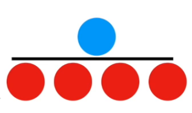
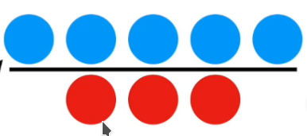
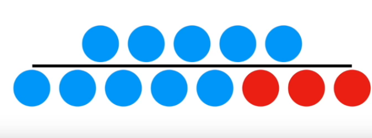
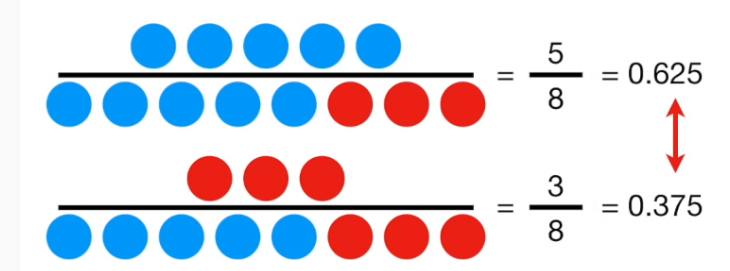
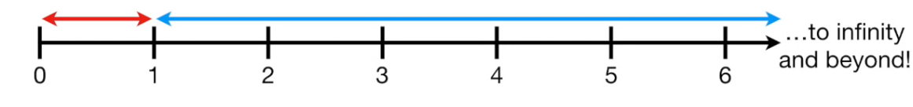
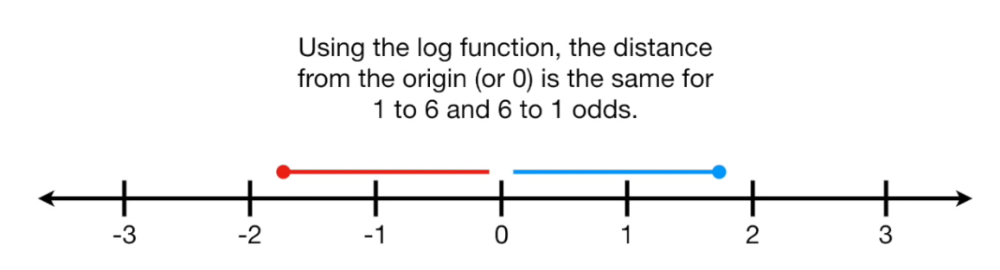

```{r setup, include=FALSE}
knitr::opts_chunk$set(
    echo = TRUE,
    cache = FALSE,
    error = TRUE,
    message = FALSE,
    warning = FALSE
)
options(
    digits = 3
)
suppressMessages(library(tidyverse))
source('../lib/logistic.R')
```


## Definition

If the odds in favor of a team winning a game are 1 to 4 then this can be written as a fraction $\frac{1}{4}$

We have 5 games in total, one of which the team will win, and four which it will lose.



The odds are `r 1/4` that the team will win the game.

Take another example. The odds in favor of the team winning the game are 5 to 3. Now the odds becomes `r 5/3`



Note: Odds are *not* probabilities. Instead they are a ratio of something happening over something not happening.

A probability is the ratio of something happening to everything that could happen:



Here the probability is `r 5/8`.

To transform odds into a probability you compute

$$
p = \frac{o}{1+o}
$$
```{r odds_to_probability}
odds2p(5/3)
```
To transform probabilities into odds you compute

$$
o = \frac{p}{1-p}
$$
```{r probabilty_to_odds}
p2odds(0.625)
```


The ratio of the probabilty of winning to the probability of losing is

$$
\frac{\frac{5}{8}}{\frac{3}{8}}
$$
Which is `r (5/8) / (1 - (5/8))` i.e. the same as the odds. (notices how the 8's cancel out)



So odds can be calculated from counts $\frac{5}{3}$ or from probabilities $\frac{p}{1-p}$

The log of the ratio of the probabilites is called the `logit` function:

$$
log(\frac{p}{1-p})
$$


If the odds are against they get smaller and smaller (closer to zero) and range from 0 to 1.

If they are in favour then range from 1 to infinity



This assymetry makes comparison difficult e.g `1 to 6` against gives `r 1/6` whereas `6 to 1` in favour gives `r 6/1`.

Taking the log of these makes the numbers symmetrical: $log(1/6)$ is `r log(1/6)` and $log(6/1)$ is `r log(6)`.



To transform the log of the odds (logits) to a probaility you use the inverse:

$$
\frac{1}{1+exp(-x)}
$$

In this case the probability of the log odds of `1 to 6` would be `r inv_logit(log(1/6))` and for `6 to 1` it would be `r inv_logit(log(6))`


## Properties of the logit

Lets take 10000 pairs of numbers that add up to 100. Together they can be used to generate a selection of odds

```{r logit_df}
lsim <- tibble(
    a = sample(1:99, 100000, replace = TRUE)
)
lsim <- lsim %>%
    mutate(b = 100 - a, odds = a / b, lodds = log(odds))
```

```{r logit_summary}
head(lsim)
```

```{r logit_range}
range(lsim$odds)
range(lsim$lodds)
```

When we draw a histogram of the log odds we find that it is normally distributed:

```{r logit_histogram}
ggplot(lsim) +
    geom_histogram(aes(x = lodds, y = stat(density)), binwidth = 0.5, colour = 'white') +
    stat_function(fun = dnorm, args = list(mean = 0, sd = sd(lsim$lodds)), colour = 'steelblue') +
    labs(x=NULL, y=NULL)
```

## Odds Ratios

Odds often come up in counts. Consider the following:

```{r odds_ratio_counts}
yesno <- c('Yes', 'No')
cm <- matrix(
    c(23, 6, 117, 210),
    nrow = 2,
    dimnames = list(mutated.gene=yesno, has.cancer=yesno)
)
cm
```

Those with cancer are the column sums:

```{r odds_ratio_colsums}
(n_cancer <- margin.table(cm, margin=2))
```

Those with the mutated gene are the row sums

```{r odds_ratio_rowsums}
(n_gene <- margin.table(cm, margin=1))
```

What we want to know is whether or not there is a relationship between the mutated gene and cancer.

This can be answered by comparing the odds. If they have the mutated gene the odds higher that they will get cancer.

The odds of having cancer given the mutated gene are

```{r odds_ratio_1}
# first columm divided by the second column
(c_odds <- cm[,1]/cm[,2])
```

```{r odds_ratio_2}
c(yes=23/117, no=6/210)
```


The odds are against getting cancer, but they differ depending on the mutated gene.

This is typically expressed as a ratio

```{r odds_ratio_3}
(o_ratio <- c_odds[1] / c_odds[2])
```

The odds are `r o_ratio` times greater.

These are like `r-squared`. large values mean that the mutated gene is a good predictor of cancer.

Taking the logarithm gives you `r log(o_ratio)`.


The significance of this can be assesed using the fisher test:

```{r odds_ratio_test}
fisher.test(cm)
```
