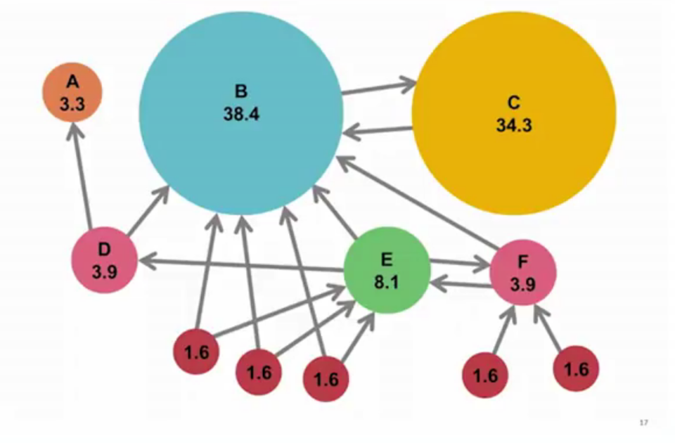
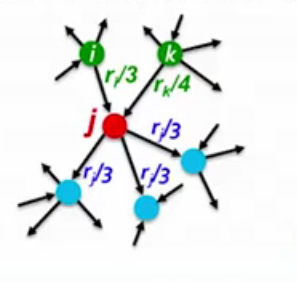
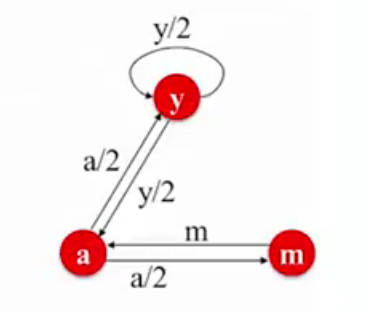
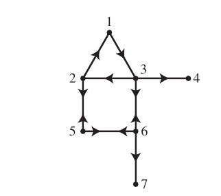

```{r setup, echo=FALSE}
source('../lib/eng_maxima.R')
source('../lib/lsq.R')
knitr::opts_chunk$set(
    echo = T,
    message = F,
    error = F,
    warning = F,
    cache = F
)
options(digits = 5)
knitr::knit_engines$set(maxima = eng_maxima)
library(zeallot)
```

## Rationale

The web can be represented as a directed graph, where the nodes represent web pages and the hyperlinks represent edges.

There are two challenges in web search:

1. Who to trust? - The trick here is that trustworthy pages will link to each other.
2. What is the *best* anser to a query such as *newspaper* - queries are ambiguous

This is addressed as follows:

1. All web pages are not equally *important*
2. There is large diversity in the web-graph node connectivity, so rank the pages by the link structure.

Here are the approaches for computing the importance (or rank) of nodes in a graph

1. Page Rank
2. Hubs and Authorities (HITS)
3. Topic-Specific (Personalized) Page Rank
4. Web Spam detection algorithms

## The Flow Formulation

This is the first mathematical formulation of page rank

The idea is to think of links as votes - a page is more important if it has more links. For example `www.stanford.edu` has 23,400 in links, `www.joe-schmoe.com` has just one.

We will consider just in links since they are much harder to fake.

Also, not all links are as important. Links from important pages count more. In this sense the importance of a page depends on the importance of other pages that link to it. This gives a recursive definition.

## PageRank Scores



The scores in the above graph have been scaled so they add up to 100.

### Recusive Formulation




1. Each links vote is proportional to the *importance* of its source page.
1. If page *j* with importance $r_j$ has *n* out-links then each of those links get $\frac{r_j}{n}$ votes.
1. Page *j's* own importance is the sum of the votes on its in-links giving us:

$$
r_j = \frac{r_i}{3} + \frac{r_k}{4} 
$$





The formula for the rank $r_j$ of a page is now very simple

$$
r_j = \sum_{i \rightarrow j}\frac{r_i}{d_i}
$$


Where $d_i$ is the out-degree of node *i*. So the rank is the sum of all the pages that point to it, divided by the out-degree of that page. This yields the following set of flow equations:

$$
r_y = r_y/2 + r_a/2 \\
r_a = r_y/2 + r_m \\
r_m = r_a/2
$$

So we have 3 equations and 3 unknowns and no constants. The problem is that this system has no unique solution:

```{maxima maxima_1, echo = FALSE}
pfeformat:true;
eqs:[y=y/2 + a/2, a = y/2 + m, m=a/2];
coefmatrix(eqs, [y, a, m]);
linsolve(eqs, [y, a, m]);
```

As you can see all the solutions are equivalent modulo the scale factor. We need an additional constraint to force uniqueness:

$$
r_y + r_a + r_m = 1
$$
In other words, our page rank scores have to sum to 1. Now our system has a solution:

```{maxima maxima_2, echo = FALSE}
pfeformat:true;
eqs:[y=y/2 + a/2, a = y/2 + m, m=a/2, y + a + m = 1];
coefmatrix(eqs, [y, a, m]);
linsolve(eqs, [y, a, m]);
```


This approach does not scale. Whats needed is a new formulation.

## The Matrix Formulation

Here we will express the page rank formulation as a stochastic adjacency matrix *M*

- Columns sum to 1

If page *i* points to page *j* then we will have a non-zero entry (actually $1/d_i$ which is the out-degree of the source node *i*) else the entry will be zero.

Consider our simple graph:


The matrix formulation then becomes $\vec{r} = M\cdot\vec{r}$

```{maxima matrix_formulation_simple_maxima}
load(rjeig)$
pfeformat: true;
M:matrix([1/2, 1/2, 0], [1/2, 0, 1], [0, 1/2, 0]);
pages:[r[y], r[a], r[m]];
M.pages;
mkeqs(pages, M.pages);
[evals, evecs]:eigordered(M);
/* steady state */
q:evecs[3];
[M.q, q];
```


### A More Complex Example

Here is a connected graph representing a 7 page web



And this is the corresponding matrix representation


```{r web_matrix_1}
page_nodes <- seq(1, 7)
P <- rbind(
    c(0, 1/2, 0, 0, 0, 0, 0),
    c(0, 0, 1/3, 0, 1/2, 0, 0),
    c(1, 0, 0, 0, 0, 1/3, 0),
    c(0, 0, 1/3, 1, 0, 0, 0),
    c(0, 1/2, 0, 0, 0, 1/3, 0),
    c(0, 0, 1/3, 0, 1/2, 0, 0),
    c(0, 0, 0, 0, 0, 1/3, 1)
)
rownames(P) <- page_nodes
colnames(P) <- page_nodes
P
```

And this matrix is column stochastic

```{r web_matrix_1_check}
# columns sum to one
apply(P, 2, sum)
# but they are not unit vectors
apply(P, 2, function(col) base::norm(as.matrix(col), type="f"))
```

And we are looking for a vector $\vec{r}$ such that $M\vec{r} = \vec{r}$ in which case each entry in $\vec{r}$ will contain the rank of the corresponding page.

The solution to this is found by finding an eigenvector $\vec{x}$ with a corresponding eigen value of 1 such that $A\vec{x} = \lambda\vec{x}$

Lets take a look at the eigen values:

```{r web_matrix_1_steady_state}
evals <- base::eigen(P, only.values=T)$values
print(round(evals, 2))
round(sapply(evals, Mod), 2)
```

Note that there are two steady state solutions. To fix this we will need to make the following adjustments

### Dangling Nodes

Pages 4 and 7 are dangling nodes and so are absorbing states for the chain.

The presence of absorbing states implies that the state vectors $x_n$ do not approach a unique limit and $n\rightarrow\infty$

To handle this assume that if a surfer reaches a dangling node, they will pick any page in the web with equal probablity and move to that page:

```{r web_matrix_2}
n <- nrow(P)
P[, c(4,7)] <- rep(1/n, n)
P
```

Lets see if this adjustment is sufficient

```{r web_matrix_2_eigen}
res <- base::eigen(P)

round(sapply(res$values, Mod), 2)
q <- res$vectors[,1];
q
sapply(q, Im)
q <- sapply(q, Re)

cbind(q, P %*% q)
prop.table(q)
order(q, decreasing=T)
```

So it is a steady state, but there are still problems. For one thing there are too zero entries and there is also another potential problem that needs to be addressd: cycles.

## Cycles

If page *j* linked only to page *i* and page *i* only linked to page *j* a random surfer would get stuck in a loop.

Let *p* be a number between 0 and 1. Assume the surfer is now at page *j*. With probability p the surfer will pick from amonge all possible links from page *j* and with probability *1-p*, the surfer will pick *any* page in the Web with equal probability and will move to that page.

In terms of the transition matrix P the new transition matrix will be:

$$
G = pP_* + (1-p)K
$$
where K is an $n \times n$ matrix all of whose columns are:

$$
\left[
\begin{array}{c}
1/n \\
1/n \\
\vdots \\
1/n
\end{array}
\right]
$$


```{r web_matrix_3}
p <- 0.85
K <- matrix(rep(1/n, n*n), nrow=n)
G <- p * P + (1-p) * K
G
```

```{r web_matrix_3_steady_state}
res <- eigen(G)
round(sapply(res$values, Mod), 2)
q <- res$vectors[,1]
names(q) <- page_nodes
# all parts are real so
q <- sapply(q, Re)
cbind(q, G %*% q)
# and these are typically expressed as probabilities
q <- prop.table(q)
# and pages in decreasing order of rank are
order(q, decreasing=T)
```

