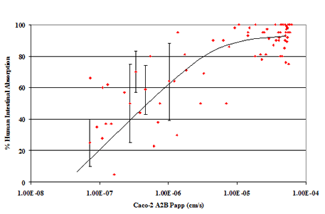

```{r setup, include=FALSE}
knitr::opts_chunk$set(echo = TRUE)
options(digits=3)
library(tidyverse)
library(zeallot)
```

Sampling bias is any process that systematically alters the distribution of observed data.8 The data scientist must be aware of the possibility of sampling bias and be prepared to detect it and fix it.

The most effective way is to fix your data collection methodology.

Suppose through some happenstance we were studying only a high-earning subset of our original population (perhaps we polled them at some exclusive event).


```{r synthetic_uncorrelated_income}
set.seed(235236)
income <- tibble(
    EarnedIncome = 100000 * rlnorm(100),
    CapitalGains = 100000 * rlnorm(100)
)
with(income, cor(EarnedIncome, CapitalGains))

```


```{r create_income_groups}
threshold <- 500000
income <- income %>% 
    mutate(TotalIncome = EarnedIncome + CapitalGains)
income_high <- income %>% 
    filter(TotalIncome >= threshold)
income_low <- income %>% 
    filter(TotalIncome < threshold)

```


```{r cor_high_income}
broom::tidy(
    with(income_high, cor.test(EarnedIncome, CapitalGains, method = 'spearman'))
)
```

When we restrict to a high-earning set, it appears that earned income and capital gains are strongly anticorrelated. We get a correlation of -0.86 (so think of the anticorrelation as explaining about $(-0.86)^2 = 0.74 = 74\%$ of the variance,  and a p-value very near 0 (so it’s unlikely the unknown true correlation of more data produced in this manner is in fact 0).

The following plots help to show what’s going on. The first plot shows the original dataset with the best linear relation line run through.

Note that the line is nearly flat (indicating change in x doesn’t predict change in y ).

```{r plot_all_income, fig.width = 8, fig.height = 8}
lim <- max(income)
# plot all income data with linear trend line and uncertainty band
income %>% 
    ggplot(aes(x = EarnedIncome, y = CapitalGains)) +
    geom_point() +
    geom_smooth(method = 'lm') +
    scale_x_continuous(labels = scales::comma) +
    scale_y_continuous(labels = scales::comma) +
    coord_cartesian(xlim = c(0, lim), ylim = c(0, lim))
```


The second plot shows the best trend line run through the high income dataset.

```{r plot_high_income}
# plots very high income data
# and linear trend line
# includes cut-off and suppressed data
income_high %>% 
    ggplot(aes(x = EarnedIncome, y = CapitalGains)) +
    geom_point() +
    geom_smooth(method = 'lm') +
    geom_point(
        data = income_low,
        mapping = aes(x = EarnedIncome, y = CapitalGains),
        shape = 4, alpha = 0.5, colour = 'red'
    ) +
    geom_segment(
        x = 0, xend = threshold, y = threshold, yend = 0,
        linetype = 2, alpha = 0.5, colour = 'red'
    ) +
    scale_x_continuous(labels = scales::comma) +
    scale_y_continuous(labels = scales::comma) +
    coord_cartesian(xlim = c(0, lim), ylim = c(0, lim))
```


It also shows how cutting out the points below the line $x+y=500000$ leaves a smattering of rare high-value events arranged in a direction that crudely approximates the slope of our cut line (`–0.8678571` being a crude approximation for `–1`).

It’s also interesting to note that the bits we suppressed aren’t correlated among themselves, so the effect wasn’t a matter of suppressing a correlated group out of an uncorrelated cloud to get a negative correlation.


```{r cor_low_income}
broom::tidy(
    with(
        income_low,
        cor.test(EarnedIncome, CapitalGains, method = 'spearman')
    )
)
```

## Omitted variable bias

### Bioavailability data

```{r load_bioavailability_data}
bio_data <- read_rds('../data/bioavailability.rds')
```

```{r bioavailability_data_summary}
skimr::skim(bio_data)
```


This loads synthetic data that’s supposed to represent a simplified view of the kind of data that might be collected over the history of a pharmaceutical ADME or bioavailability project.

> ADME stands for absorption, distribution, metabolism, excretion; it helps determine which molecules make it into the human body through ingestion and thus could even be viable candidates for orally delivered drugs.

We’ve constructed this synthetic data to represent a project that’s trying to optimize human absorption by working through small variations of a candidate drug molecule.

At the start of the project, they have a molecule that’s highly optimized for the stand- in criteria Caco2 (which does correlate with human absorption), and through the history of the project, actual human absorption is greatly increased by altering factors that we’re not tracking in this simplistic model.

During drug optimization, it’s common to have formerly dominant stand-in criteria revert to ostensibly less desirable values as other inputs start to dominate the outcome.

So for our example project, the human absorption rate is rising (as the scientists successfully optimize for it) and the Caco2 rate is falling (as it started high, and we’re no longer optimizing for it, even though it is a useful feature).

```{r plot_caco2_human_absorption}
bio_data %>% 
    ggplot(aes(x = week, y = FractionHumanAbsorption)) +
    geom_point() +
    geom_line() +
    scale_y_continuous(limits = c(0, 1))


```

```{r plot_caco2_absorption}
bio_data %>% 
    ggplot(aes(x = week, y = Caco2A2BPapp)) +
    geom_point() +
    geom_line()
```
### Bioavailability columns

`week`

: In this project, we suppose that a research group submits a new drug candidate molecule for assay each week. To keep things sim- ple, we use the week number (in terms of weeks since the start of the project) as the identifier for the molecule and the data row. This is an optimization project, which means each proposed molecule is made using lessons learned from all of the previous molecules. This is typical of many projects, but it means the data rows aren’t mutually exchangeable (an important assumption that we often use to justify statistical and machine learning techniques).


`Caco2A2BPapp`

: This is the first assay run (and the *cheap* one). The Caco2 test measures how fast the candidate molecule passes through a membrane of cells derived from a specific large intestine carcinoma (cancers are often used for tests, as noncancerous human cells usually can’t be cultured indefinitely). The Caco2 test is a stand-in or analogy test. The test is thought to simulate one layer of the small intestine that it’s morphologically similar to (though it lacks a number of forms and mechanisms found in the actual small intestine). Think of Caco2 as a cheap test to evaluate a factor that correlates with bio-availability (the actual goal of the project).

`FractionHumanAbsorption`

: This is the second assay run and is what fraction of the drug candidate is absorbed by human test subjects. Obviously, these tests would be expensive to run and subject to a lot of safety protocols. For this example, optimizing absorption is the actual end goal of the project.


### Building data that improves over time


#### Finding the coefficients


This data is transcribed from Figure 4 of the public promotional material found at: [Caco-2 Permeability Assay](http://www.cyprotex.com/admepk/in-vitro-permeability/caco-2-permeability/) and was converted to numeric estimates using [WebPlotDigitizer](http://arohatgi.info/WebPlotDigitizer/).  This may seem a bit aggressive, but such actions are allowed under [fair use](http://en.wikipedia.org/wiki/Fair_use) (one of the rights copyright holders must grant in return for government copyright protection; in this case we meet many of the intended terms/factors of fair use:  we are using for research of a small amount factual data with no negative effect on the original).  Also, a data scientist is going to have to get use to doing some work to get data.

The original Figure 4 is:




This graph relates the measured rate of [Caco2](http://en.wikipedia.org/wiki/Caco-2) permeability which is how fast a molecule travels across a monolayer of cells derived from a large intestine carcinoma.  The hope is that even though the immortal cell culture is not a working organ that Caco2 permeability rates predict how much of a drug will be ingested through a human small intestine (before passing to the large intestine, which is less involved in complicated molecule absorption than the small intestine).  You can see Caco2 is a test by analogy: whole human absorption is estimated from a cell culture using different mechanisms than the actual complete human body.  So Caco2 doesn't determine the [ADME](http://en.wikipedia.org/wiki/ADME) properties of a drug, but is considered a useful correlated signal or feature to measure.

```{r load_caco2}
caco2 <- read_csv('../data/caco2.csv')
```


```{r plot_caco2}

caco2 %>% 
    ggplot(aes(x = Caco2A2BPapp, y = FractionHumanAbsorption)) +
    geom_point() +
    geom_smooth() +
    scale_x_log10() +
    scale_y_continuous(limits = c(0, 1))
```

This allows us to build a very crude logistic model (Beta regression would also be appropriate here) relating Caco2 permeability rate to human intestinal absorption:

```{r caco2_model}

caco2_model <- glm(
    FractionHumanAbsorption~log(Caco2A2BPapp),
    data = caco2,
    family=binomial(link='logit')
)
cacoEffect <- caco2_model$coefficients['log(Caco2A2BPapp)']
caco2_coef <- broom::tidy(caco2_model)
c(Intercept, cacoEffect) %<-% caco2_coef$estimate
```


This gives us the estimate that `log()` increase of `cm/s` unit measured of Caco2 permeability tends to increase the logit of human intestinal absorption fraction by `r format(cacoEffect)`.

This will be used to produce our deliberately problematic synthetic example.

```{r caco2_model_plot}
caco2 %>% 
    modelr::add_predictions(caco2_model, type = 'response', var = 'model') %>% 
    ggplot(aes(x = Caco2A2BPapp)) +
    geom_point(aes(y = FractionHumanAbsorption)) +
    geom_line(aes(y = model)) +
    scale_x_log10()
```


What we want is a data-set that might be typical of a drug series being optimized.  In projects as intense as drug optimization you see early candidate drugs "that have all the typical features" and work okay.  Later candidate drugs tend to work better (the optimization) but often don't have as many of the features that were thought to be important early in the project (as the feature relations are not strict, and it is not always possible for a drug candidate to simultaneously be the best on many different scales).

So you would expect to see the percent human absorption going up over time (as better and better drug candidates are made).  If the initial candidate drugs were optimized for Caco2 permeability you might also see Caco2 permeability go down as actual human ADME is optimized (as we move away from the initial Caco2 favored candidates).  A naive analysis of only data from such a series could easily (through [omitted variable bias](http://en.wikipedia.org/wiki/Omitted-variable_bias) (see also [confounding variables](http://en.wikipedia.org/wiki/Confounding_variable) and [nuisance variables](http://en.wikipedia.org/wiki/Nuisance_variable)) imply a relation that good Caco2 relates to bad ADME (when in fact we tend to believe good Caco2 relates to good ADME).  This is why you can not always get away with a simple every variable is equal "spray and pray" style of data analysis.

```{r building_data_that_improves_over_time}
sigmoid <- function(x) {
    return(1 / (1 + exp(-x)))
}
set.seed(2535251)
s <- tibble(week = 1:100)
s$Caco2A2BPapp <- sort(sample(bio_data$Caco2A2BPapp,100,replace=T), decreasing=T)
s$FractionHumanAbsorption <- sigmoid(
    # add absorption relation learned from original dataset.
    # Note that the relation is positive:
    # better caco2 always drives better absorption in our synthetic dataset
    7.5 + 0.5 * log(s$Caco2A2BPapp) + 
    # add in a mean-0 term that depends on time to simulate
    # the (linear) effects of improvements as the project moves forward
    s$week / 10 - mean(s$week / 10) + 
    # mean0 noise term
    rnorm(100) / 3
)
```

```{r plot_synthesized_data}
s %>% 
    ggplot(aes(x = week, y = FractionHumanAbsorption)) +
    geom_point() +
    geom_line()
```


### A spoiled analysis

In some situations, the true relationship between `Caco2` and `FractionHumanAbsorption` is hidden because the variable week is positively correlated with Fraction- HumanAbsorption (as the absorption is being improved over time) and negatively correlated with `Caco2` (as Caco2 is falling over time). week is a stand-in variable for all the other molecular factors driving human absorption that we’re not recording or model- ing.

Lets see what happens when we try to model the relation between `Caco2` and `FractionHumanAbsorption` without using the week variable or any other factors.

```{r}
model_1 <- glm(
    FractionHumanAbsorption ~ log(Caco2A2BPapp),
    data = s,
    family = binomial(link = 'logit')
)
summary(model_1)

```

Note that the sign of the Caco2 coefficient is negative, not what’s plausible or what we expected going in. This is because the Caco2 coefficient isn’t just recording the relation of Caco2 to FractionHumanAbsorption, but also having to record any relations that come through omitted correlated variables.


### Working around omitted variable bias

```{r a_better_model}
model_2 <- glm(
    FractionHumanAbsorption ~ week + log(Caco2A2BPapp),
    data = s,
    family = binomial(link = 'logit')
)
summary(model_2)
```
