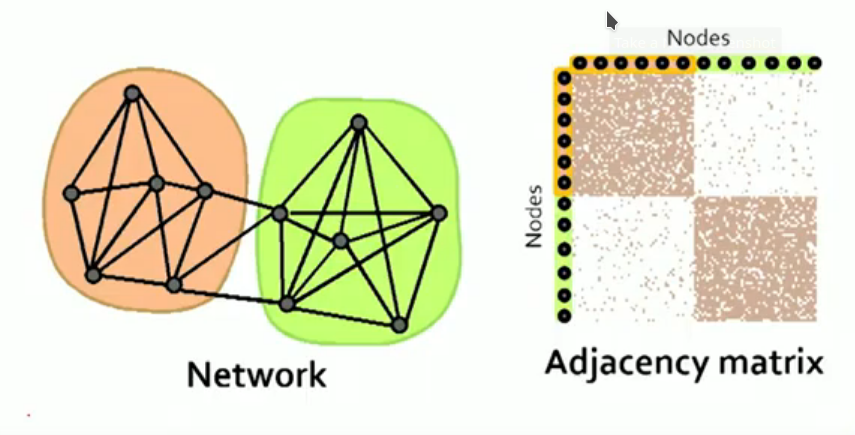
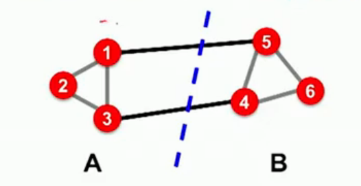
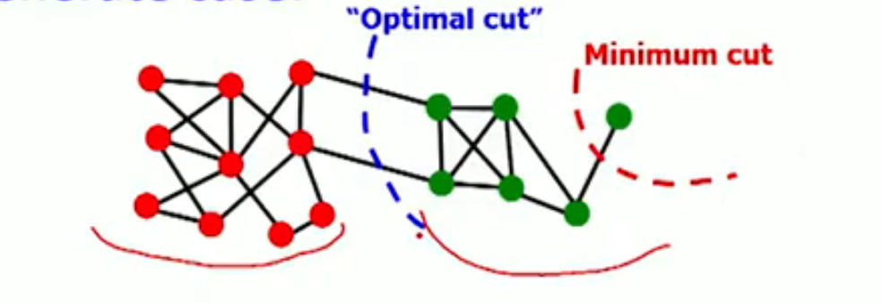
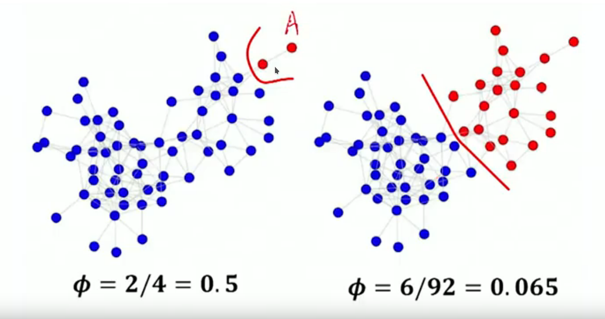
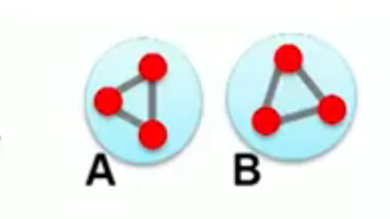
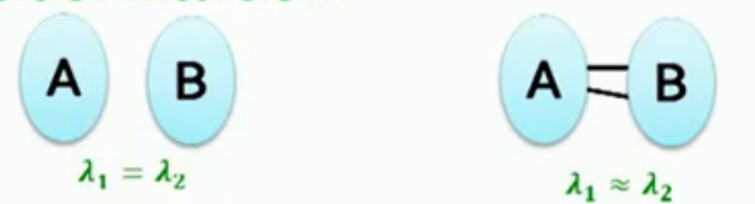
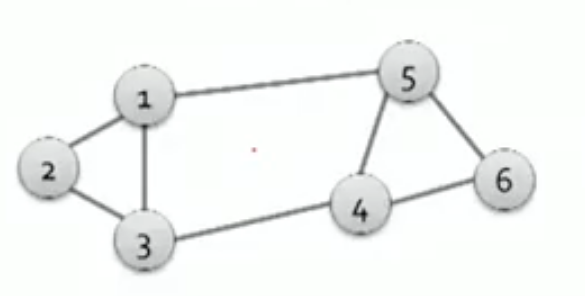
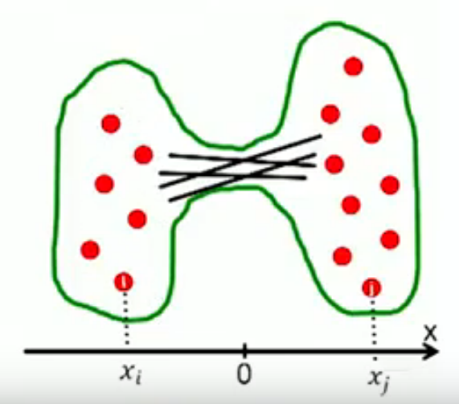
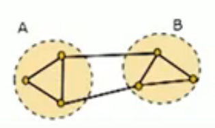

```{r setup, echo=FALSE}
knitr::opts_chunk$set(
    echo = T,
    message = F,
    error = F,
    warning = F,
    cache = T
)
options(digits = 5)
source('../lib/lsq.R')
```

## What are we looking for?




##The Graph Laplacian Matrix

We want to partition the graph into 2 pieces such that the resulting pieces have low conductance.

Note that computing the optimal cut is NP-hard



Remember that conductance is the relationship between how many edges are pointing inside a set of nodes and how many edges are pointing outside.

We want to maximize the within-cluster of connections and minimize the number of between-cluster connections.

### Cut Score

In the graph above $cut(A) = cut(B)=2$

But consider this de-generate case:



We need to consider internal cluster connectivity, not just external cluster connecctions.

## Conductance

Define $vol(A)$ as the total weight of the edges with at least one endpoint in A, then the conductance is the cut of A divided by the volume of A:

$$
\phi(A) = \frac{cut(A)}{min(vol(A),2 m - vol(A))}
$$

where *m* is the number of edges of the graph and the volume is the sum of the degrees of each node in A.

The smaller $\phi$, the better the conducance.

Note that the expression in the denominator $min(vol(A),2 m - vol(A))$ ensures that it is less than half the size of the graph. This ensures that the *size* of the set A never overpowers.



Notice how much more balanced the sets are in the second partition.

## Eigen Docompositions of Graphs

Consider the following equation:

$$
\left[
\begin{array}{ccc}
a_{11} & \dots & a_{1n} \\
\vdots & \dots & \vdots \\
a_{n1} & \dots & a_{nn}
\end{array}
\right]
\left[
\begin{array}{c}
x_1 \\
\vdots \\
x_n
\end{array}
\right]
=
\left[
\begin{array}{c}
y_1 \\
\vdots \\
y_n
\end{array}
\right]
$$

where A is the adjacency matrix of the undirected graph G and $\vec{x}$ is a vector representing each node.

What is the meaning of $A\cdot\vec{x}=\vec{y}$

In this case the $j^{th}$ coordinate of  $A \cdot \vec{x}$ will be the sum of the x-values of the neighbors *j*.

So now think of it as an eigen value problem $A \cdot \vec{x} = \lambda \cdot \vec{x}$

Remember the *spectrum* is a set of eigen vectors ordered by the magnitude (strength) of their corresponding eigen values.

Lets start with a *d-regular* connected graph where all nodes have the same degree *d*

Lets start with the vector of ones: $\vec{x} = (1, 1, \dots, 1)$

In this case $A\cdot\vec{x} = (d, d, \dots, d) = \lambda \cdot \vec{x}$, so $\lambda=d$

So now we have found an eigen pair of G: $x = (1, 1, \dots, 1), \lambda=d$

Now what if the graph is not connected, e.g G has 2 components, each d-regular



For the vectors where you put 1 on A and 0 on B, or vice versa:

- $x\prime = (1, 1, 1, 0, 0, 0)$ then $A\cdot\vec{x}\prime = (d, d, d, 0, 0, 0)$
- $x\prime\prime = (0, 0, 0, 1, 1, 1)$ then $A\cdot\vec{x}\prime\prime = (0, 0, 0, d, d, d)$

In both cases the corresponding $\lambda = d$

This means that if a graph has two connected components then there will be two eigen vectors whose eigen values are close, i.e. $\lambda_1 \approx \lambda_2$




## Defining the Graph Laplacian

Consider the following graph



Here is the adjacency matrix

```{r adjacency_matrix}
nodes <- seq(1, 6)
A <- matrix(c(
    0, 1, 1, 0, 1, 0,
    1, 0, 1, 0, 0, 0,
    1, 1, 0, 1, 0, 0,
    0, 0, 1, 0, 1, 1,
    1, 0, 0, 1, 0, 1,
    0, 0, 0, 1, 1, 0
), nrow=6, byrow=T)
rownames(A) <- nodes
colnames(A) <- nodes
A
```

Note the following important properties:

- The matrix is symmetric
- The eigenvectors are real and orthogonal

Here is the degree matrix

```{r degree_matrix}
ATA <- t(A) %*% A
D <- matrix(Matrix::Diagonal(x=diag(ATA)), nrow=6)
rownames(D) <- nodes
colnames(D) <- nodes
D
```

And, finally here is the Laplacian matrix:

```{r laplacian_matrix}
# the degree matrix - the adjacency
L <- D - A
L
```

Where -1 indicates that nodes i and j are connected, and 0 means that they are not.


```{r laplacian_matrix_properties}
rowSums(L)
colSums(L)
```

What is a trivial eigen pair?

```{r laplacian_matrix_trivial_eigen_pair}
x <- rep(1, 6)
L %*% x
```

So $L \cdot \vec{x} = 0$ which means that $\lambda = \lambda_1 = 0$

Some important properties

- Eigenvalues are non-negative real numbers
- Eigenvectors are real and orthogonal


## Finding a Partition

What is the meaning of $min(\vec{x}^T L \vec{x})$ on G, where x is the second eigen vector of L?

$$
\lambda_2 = \sum_{(i,j \in E)} (x_i - x_j)^2
$$
Sum over all the edges the squared differences. Note

- x is a unit vector
- x is orthogonal to the first eigenvector $(1, \dots, 1)$, so the sum of all its entries sum to zero.

Thus we want to assign values $x_i$ to nodes *i* such that few edges cross 0 and where $x_i$ and $x_j$ subtract each other.



Some to the left of zero and some to the right. Only the edges that cross zero will be non-zero. This is what is being minimized.


```{r laplacian_matrix_eigen_decomposition}
res <- base::eigen(L)
evals <- round(res$values, 2)
evals
evecs <- round(res$vectors, 2)
colnames(evecs) <- evals
rownames(evecs) <- nodes
evecs
```

Finally we can group nodes to two clusters based on this new representation

```{r}
x <- rep(1, 6)
L %*% x
round(uvec(x), 2)
# we want the next one
v2 <- evecs[, 5]
vnorm(v2)
v2
```



TBC
